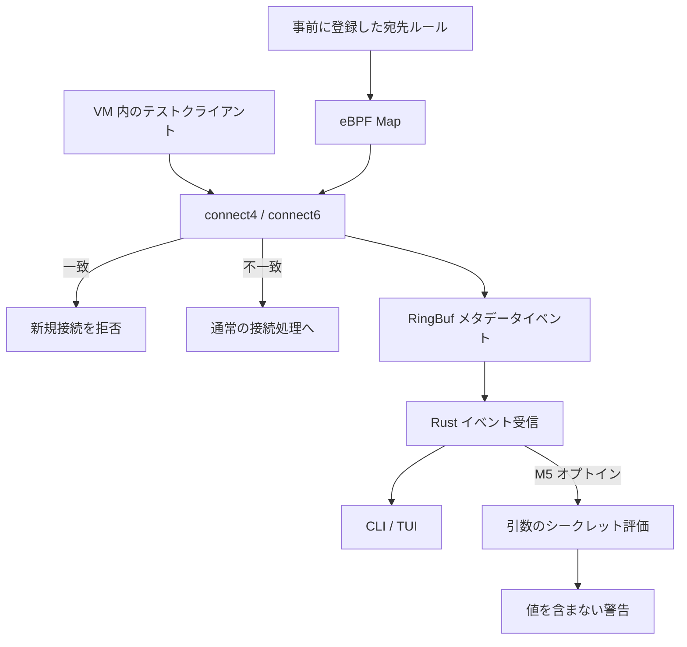

# veil-warden アーキテクチャ

## 対象と境界

自分の Linux ARM64 VM 内で、新しく作るソケットを使う合成テストプロセスを対象にする。VM 専用 cgroup に絞り、ルート cgroup、管理用 SSH、ホスト macOS は対象に含めない。ホストの機密ファイル共有、実資格情報、外部受信サーバーは不要。

学習用の拒否機構は悪意のある root を防ぐ境界ではない。cgroup 外のプロセス、既存/受け渡されたソケット、未対応プロトコルを含めた「全通信」の制御は主張しない。

## データの流れ

許可イベントは「このフックで拒否しなかった」という意味。宛先との接続成功や送信成功は意味しない。シークレット評価は接続判断と非同期であり、警告から自動的に IP を拒否しない。

## フックの役割

| 機能 | フック | 取得する情報 | 制約 |
| --- | --- | --- | --- |
| M1 パケット数 | cgroup_skb egress | パケット数、必要なら byte 数 | PID 特定を要求せず、常に許可 |
| M2 接続監視 | cgroup_sock_addr connect4/connect6 | 呼出し時の TGID/TID、宛先、プロトコル | 接続試行でありパケット数ではない |
| M3 接続拒否 | 同じ connect4/connect6 | 事前ルール一致と判断 | 既存接続の送信を止めない |

M2/M3 の保証対象は TCP の新規接続に限定する。非 TCP イベントは対象外と明示する。未接続 UDP の sendto/sendmsg、QUIC、受信通信、raw socket、Unix socket、パケット書き換えは週末の対象外。IPv4 と IPv6 は両方検証する。

呼出しスレッドの ID は、ソケットを実質的に所有するアプリケーションの ID と常に同じとは限らない。PID namespace、プロセス終了、PID 再利用を考慮し、/proc から名前を取得できなくてもイベント自体を失敗扱いにしない。

## イベント ABI（M2で実装済み）

common クレートは no_std。固定幅の整数・バイト配列と repr(C) で共有する。接続イベントは PacketLog ではなく ConnectEvent と呼ぶ。

| 順序 | フィールド | 型 | 意味 |
| --- | --- | --- | --- |
| 1 | timestamp_ns | u64 | 起動後の単調増加時刻、壁時計ではない |
| 2 | cgroup_id | u64 | 対象 cgroup の識別 |
| 3 | tgid | u32 | 呼出しプロセス ID |
| 4 | tid | u32 | 呼出しスレッド ID |
| 5 | address | [u8; 16] | IPv6 は全16 byte、IPv4 は先頭4 byteと残りゼロ |
| 6 | port | u16 | カーネル側で変換したホスト順の宛先ポート |
| 7 | abi_version | u16 | 受信側が対応版を確認 |
| 8 | family | u8 | 共有仕様の値 4/6、OS の AF 定数を流用しない |
| 9 | protocol | u8 | IP protocol 番号 |
| 10 | action | u8 | 許可=0 / 拒否=1、非TCPはイベント対象外 |
| 11 | hook | u8 | connect4/connect6 の区別 |
| 12 | policy_id | u32 | 拒否ルールの ID、該当なしはゼロ |
| 13 | reserved | u32 | 必ずゼロ |

この並びのサイズは 56 byte、alignment は 8 byte。M2では両コンパイラでサイズ・alignment・offsetを検査し、implicit padding がないことと全フィールド初期化を確認する。repr(C) だけで正しい初期化や有効なデコードを保証しない。ABI を変更したら版を変える。

IPはnetwork octetで格納し、portはkernelで一度だけhost-valued整数へ変換する。ABI v2の整数bytesはlittle endian（固定BPF targetはbpfel）とする。受信は長さ・版・family・action を検証してから値をコピーする。短いデータを無条件に read_unaligned しない。Pod の unsafe 実装は対象型の契約を確認した場合だけ使う。未知版/不正データはデコードエラーとして計数し、安全な通信とは判定しない。

## Map と所有

- COUNTERS: M1 の per-CPU カウンタ。累積値を集計する。
- EVENTS: RingBuf。M2でTokio AsyncFdのreadinessとnextによるdrainを実装。16 KiB固定。空まで読む場合だけreadyをclearし、128件ごとにyieldする。
- STATS: M2ではTCP試行数、発行数、RingBuf予約失敗数をper-CPUで計数。M3で拒否数を追加。
- MODE: Arrayの1 slot、0=observe、1=enforce。ルールとmodeはattach前に準備する。
- DENY_DESTINATIONS: 最大16件のHashMap。20 byteのキーと非ゼロu32のルールID。M3 の宛先 Map。対象 cgroup 専用の Map とし、family・アドレス・port・protocol で一致判定する。IP だけの自動登録はしない。

ユーザー側の loader が Ebpf、Map、link を所有する。長寿命タスクへ渡す Map は take_map 等で所有可能な形にする。&mut Ebpf から借りた Map をそのまま static な非同期タスクへ持ち込まない。イベント受信とポリシー更新の責務を分ける。

M3 の操作は単一ルールの追加/解除まで。bulk replacement や CIDR、永続化は後回し。更新失敗時は成功表示せず、現在の Map の状態を表示する。IPv4-mapped IPv6はpolicyキーだけIPv4へ正規化し、イベントは実際のhook/family/addressを保持する。キーはaddress octets 16 byte、little-endian port 2 byte、family 1 byte、protocol 1 byte。隠れたpaddingやunsafe Podを使わない。

## 負荷と失敗時

RingBuf 満杯でも接続判断を待たせない。事前ルールに従って判断し、イベント送信失敗を別に計数する。M2は表示queue128件、単一表示worker、履歴/名前cacheなしとし、欠落数を表示する。/proc 読み取りと M5 スキャンで受信ループを止めない。

初期モードは observe。enforce は明示指定し、検証済みルールを両 family 用のフックへ準備してから対象クライアントを開始する。片方の attach 失敗時は起動を失敗として扱い、取得したリンクを解放する。

VM の実験用プログラムはリンクを pin しない。BPF link の FD 寿命で解除できる方式を選び、M0 で必要な機能を確認する。正常終了、SIGTERM、SIGKILL 後の解除を M3 で実測する。停止時は通信が再開する fail-open の学習ツールと明示する。防壁が停止した後も保護が続くとは表示しない。

## シークレットとログ

M5 は専用テスト cgroup の argv を明示的に選んだ場合のみ評価する。environ は初期対象外。検知対象の生値、argv 全文、環境変数、payload は stdout/journal/TUI/成果物へ出さない。出力は PID、宛先、ルール ID、検知件数、評価状態に限る。comm を表示する場合も制御文字を除去し、長さを制限する。

読み取り拒否、プロセス終了、サイズ上限超過、非 UTF-8、スキャン失敗は「未評価/不完全」を区別する。検知なしはスキャン対象内の結果に過ぎず、通信の安全宣言に使わない。トークンが argv に存在しても、その接続で送信された証拠にはならない。

## VM とサービス

独立した ARM64 Linux VM を第一候補とする。VM に CPU/メモリ/ディスクの上限を設け、管理用接続を実験 cgroup の外に置く。Verifier と VM はリスクを下げるが、100%安全や秒単位の復旧を保証しない。

NixOS のサービスは M6 で実装し、初期は無効・observe。CLI/daemon は同じイベント処理を利用するが、daemon で端末初期化を行わない。root は VM 内の初期検証で必要な範囲に限り、常駐時の capability とファイル権限は実カーネルで確認する。memlock と memcg の条件を診断し、無条件に LimitMEMLOCK=infinity を必須としない。

## 実装状況

M0 の VM 設定と Rust のアーキテクチャガードを実装しました。専用 slice の実パスは `/warden.slice/warden-test.slice` です。環境はルートの flake/lock で固定し、専用 VM の root は一時的なメモリ領域、共有は公開鍵ディレクトリだけに限定しています。

M1のcounterとM2のConnectEvent ABI、RingBuf、非同期受信は実装済みです。M3の通信拒否・ルールMap・root用制御ソケットも実装済みです。M4のTUIも実装済みです。secret scanは以降の設計です。M2でも正常終了・SIGTERM・SIGKILLと部分起動失敗のリンク解放を実測しています。実測結果は [M0](../milestones/00-sandbox/README.md)、安全性の説明は [安全性文書](SAFETY.md) を参照してください。

## M3 制御経路と判断の順序

CLIは `--enforce` を明示したときだけ拒否Mapを参照するモードに設定する。kernelは非TCPを許可し、TCPの宛先キーを作り、modeとルールIDを値としてコピーして判断する。拒否数を計数してからRingBufを予約するため、予約失敗でも同じ判定を返す。拒否イベントはaction=1かつpolicy_id非ゼロ、許可はaction=0かつpolicy_id=0。意味を拡張したためABI版を2へ更新し、旧版イベントを拒否する。

ユーザー空間のcontrollerはMapを所有し、追加はBPF_NOEXISTで重複を拒否、解除は存在しないキーもエラーにする。Map操作の成功後だけ成功応答を返す。失敗時は原因と現在のMap一覧を返し、CLIは非ゼロで終了する。各操作は単一キーに限り、ルール集合全体のtransactionやconnectと更新の厳密な時刻順序は保証しない。

制御はLinux abstract Unix socket `veil-warden-policy` を使う。ファイルを作成せず、pinもせず、プロセス終了でendpointを解放する。peer credentialのUID 0だけを受け付け、クライアントもサーバーのUID 0を確認する。要求は256 byte、応答は4096 byte以内、通信は2秒のサーバーtimeoutと3秒のクライアントtimeoutで制限する。処理は受信ループと直列なので、遅い制御要求はログ受信を最長2秒遅らせ得る。kernelの拒否判断は独立して継続する。

## M4 TUIの所有と状態

`connect --tui` はM3と同じloader・RingBuf・controllerを使う。描画・入力は専用thread、comm解決は別worker、受信とMap更新は既存のTokioループが担当する。frontendはrule keyを有界操作queueへ送り、controllerが実Mapを書き換える。TUIは制御socketに接続せず、新しいdaemon IPCも作らない。

backendの準備状態・最新stats・最大16件のルール・単一操作応答をMutexで共有する。短い状態コピー中だけlockを保持し、描画やproc読み取り中に保持しない。イベントは128件のqueueを2段通し、2段目の欠落も独立計数する。UI履歴は128件のVecDequeで、確認中のtupleは履歴とは別に保持する。操作待ちの間は次の操作を準備しない。

UI起動のraw mode / alternate screenはSessionが所有する。初期描画に失敗したらBPFをattachせず復元する。途中のエラー・終了は取得済みlinkを解放し、backendの終了状態を伝えてfrontendをjoinする。SessionのDropでも復元を試みる。SIGKILL/abortではRustのDropは動かないため端末復元は保証しない。
