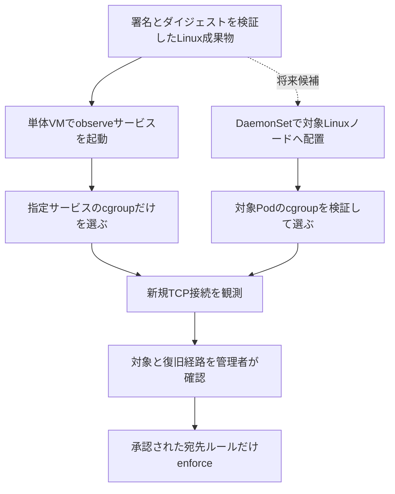
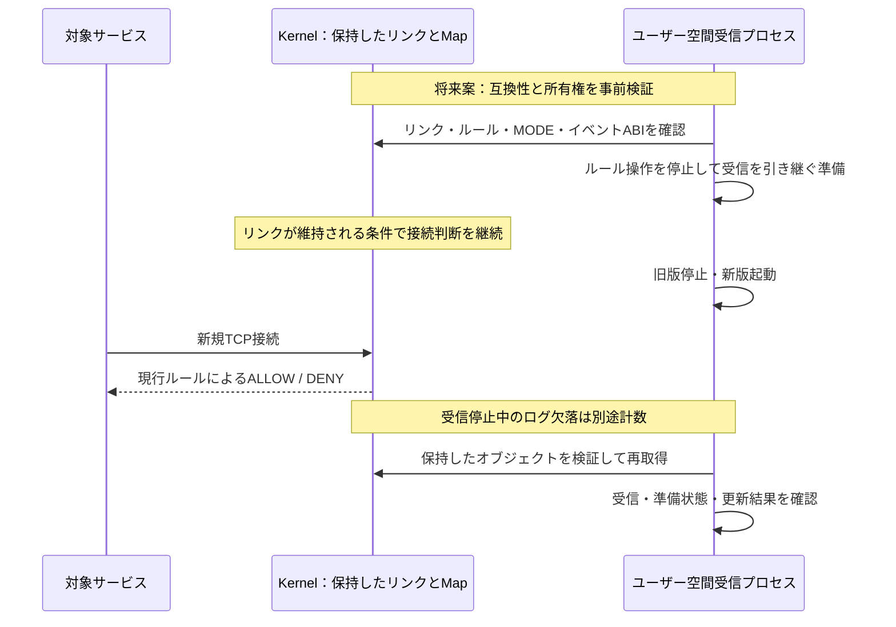

# Linuxサーバーへの導入と稼働中の更新：設計候補

[README](../README.md) / [文書一覧](README.md) / [利用場面](USE_CASES.md)

**状態：設計候補。未実装・未検証。** この文書は本番導入手順や無停止保証ではありません。現在は専用NixOS VMの固定cgroupに限り、FDで所有するBPFリンクを使います。終了時にはリンクを解放し、拒否ルールも永続化しません。AWS/GCPへの配布、サービス常駐、bpffsピン留め、更新機構は未実装です。ローカルVMはQEMU/NixOSであり、Colimaを使う構成ではありません。

## 目的と採否

検討する目的は「Linux上の一つの指定サービスについて、新規TCP接続の宛先ルールを、管理者が確認して更新できること」です。AWS/GCPは配置先の候補で、クラウド全体を保護する機能やB2B製品の完成を意味しません。

現時点の判断は、模擬TUIと実VMの利用体験を整え、この文書を将来の検討材料として残すところまでです。具体的な利用者・対象サービス・既存手段の不足が確認できるまでM6以降の実装は開始しません。systemdのIP制限、ホストファイアウォール、Kubernetes NetworkPolicyで解決できる場合は、それを選ぶ案も比較します。

## 導入の順序

最小の候補は単体Linux VMへのsystemdサービス導入です。Kubernetes対応はcgroupの探索・Podの寿命・権限・既存エージェントとの共存が増えるため、その次の候補とします。

単体VMでは、配布物の検証、対応kernel/CPU/cgroup v2の確認、管理用SSHを対象外にすること、初期observe、起動失敗時の再起動制限、CPU/メモリ/ログ上限、停止と復旧を先に決めます。配布はAMIへの同梱や構成管理を候補とし、未検証のダウンロードをそのままrootで実行する手順は用意しません。

KubernetesのDaemonSetは、条件に合うノードへPodを配置する仕組みです。配置されたことと監視準備完了を区別し、各ノードの準備状態・イベント欠落・更新失敗を見えるようにします。Pod再作成で変わるcgroupの識別と寿命、ノードのkernel・CPU対応、配置対象外のノードも検証が必要です。[Kubernetes公式仕様](https://kubernetes.io/docs/concepts/workloads/controllers/daemonset/)

`privileged: true`、`hostPID: true`、`hostNetwork: true`を付けても、指定フックが全プロセス・全プロトコルへ自動的に広がることはありません。必要なcapability、cgroup/bpffsの参照、ホストPIDやネットワーク名前空間の必要性を個別に評価します。最小権限を実証するまで実行可能なDaemonSet/Helmマニフェストは提供しません。全ノードで特権エージェントを動かすこと自体の影響も判断対象です。

## 更新で維持したいものを分ける

| 対象 | 更新中に確認すること |
| --- | --- |
| アプリの稼働 | アプリを停止しなくても、依存先への新規接続が拒否されれば業務は止まり得る |
| 接続判断 | 更新中も対象フック・MODE・宛先ルールが有効であること |
| 観測ログ | 受信停止・RingBuf容量超過で欠落し得る。接続判断の継続と別に確認する |
| ルールと状態 | Map互換性、ID、更新世代、操作中の競合を維持すること |
| 復旧 | 更新失敗時に旧版を維持・復帰でき、管理経路を確保できること |

「ゼロダウンタイム」「パケット漏洩ゼロ」を一括して約束しません。このフックの対象は新規TCP接続であり、パケット全体のDrop機構ではありません。現在の拒否結果は `EPERM` です。

## 案A：ユーザー空間だけを更新する

この案は、BPFプログラム・Map・イベント形式を変えない更新に限定します。bpffsにMapだけを保持してもattachの寿命は保証できません。対象cgroupへのBPFリンクも保持し、再起動後に所有権と互換性を検証して再取得する必要があります。

bpffsの保持はホスト再起動を越えるディスク永続化ではありません。再起動時には、検証した成果物とルールから再構築する設計が別途必要です。カーネルのオブジェクト寿命とピン留めの根拠は [Linux UAPI](https://github.com/torvalds/linux/blob/v6.12/include/uapi/linux/bpf.h) を参照してください。

拒否を残したままユーザー空間が故障する方式は、現在の「終了で拒否解除」と異なる運用契約です。明示的に選択し、独立した管理者用解除経路を検証するまで採用しません。異常時に無条件で自動解除するか、拒否を残すかも、可用性と接続制限の要求から決めます。

## 案B：eBPFプログラムも交換する

リンクを外して新しくattachするだけでは判断の空白を避けられません。対応kernel・フック・AyaのAPIを確認した上で、既存リンクのプログラムを交換する `BPF_LINK_UPDATE` を候補とします。このリポジトリではまだ採用していません。[Linux UAPIの更新操作](https://github.com/torvalds/linux/blob/v6.12/include/uapi/linux/bpf.h)

1. 新版を署名・ダイジェストで検証し、attach前にVerifierを通す。既存リンクは維持する。
2. 対象cgroup、旧リンク、Mapの型・キー/値サイズ・容量・フラグ、MODEとイベントABIの互換性を検証する。不一致なら更新を開始しない。
3. 更新者を一つに限定し、ルール操作を一時停止する。旧版のプログラム参照と復帰に必要なMapを保持する。
4. 想定する旧プログラムを条件にして、IPv4・IPv6の各リンクを更新する。一方だけ成功した状態を検出する。両リンクを一括交換できるとは扱わない。
5. 対象内・対象外、許可・拒否・解除とイベントABIを確認する。失敗したら保持した旧プログラムへ戻す。復帰も失敗したら、混在状態を明示して管理者用の復旧手順へ移る。

MapやイベントABIを非互換に変える場合は、この手順の対象外です。世代別Map、ルール移行、二重受信、バッファの切替、両フックの整合性を別に設計するか、明示した保守時間で更新します。「Mapに再接続すればよい」だけでは済みません。

## 小さく検証して終える条件

実装判断後も、最初の検証は専用VM内の合成loopback通信だけで行います。実サーバー、クラウド課金、本番権限の変更は別の承認範囲です。

| 試験 | 合格・中止判断に使う証拠 |
| --- | --- |
| ユーザー空間の再起動中に接続を継続 | 許可・拒否のerrno、受信数、リンクID、Map内容、ログ欠落数を別々に記録 |
| 互換なBPF交換 | IPv4/IPv6それぞれの更新世代と判断結果を記録 |
| 新版のロード・互換性・片側更新を失敗させる | 旧版維持または復帰の結果、混在状態を記録。失敗を成功扱いしない |
| 二重起動・同時更新・プロセス強制終了 | 更新所有権と解除経路が機能し、管理用SSHが維持される |
| 再起動・アンインストール | 保持した拒否の復旧契約を確認。解除は対象リンクだけに限定 |

対象外通信への影響、管理経路の喪失、復帰不能、解除できない拒否残留があれば中止します。固定環境の試験を通っても、任意のAWS/GCP環境やログ欠落ゼロを保証しません。利用者の具体的な要求が得られなければ設計候補のまま終了し、主力プロダクトへ戻ります。
