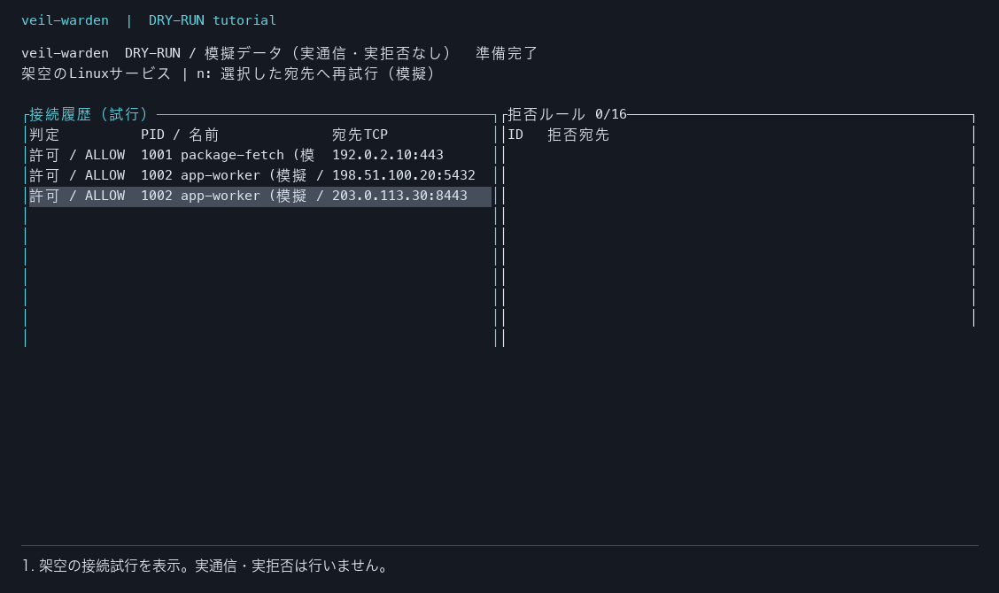

# 何に使うか・TUIをどう使うか

[README](../README.md) / [文書一覧](README.md)

veil-wardenは、Linuxの指定したプロセスグループについて「どこへ新しいTCP接続を試みたか」を見て、明示した宛先への次の接続を拒否する仕組みを試す研究用ツールです。現在の実監視は専用NixOS VM内の合成プロセスに限定します。Macのアプリや運用中サーバーの通信をそのまま監視する製品ではありません。

## 最初はMacの模擬TUIで操作する

インストール済みなら、どこからでも次を実行します。更新後はリポジトリで `./scripts/install-cli.sh` を一度実行してください。

```sh
veil-warden
# 同じモードを明示する場合
veil-warden tui --dry-run
```

VMの準備は不要です。3件の架空イベントが最初から表示されます。実際の通信、ホストのプロセス情報取得、eBPFロード、ルール適用は行いません。画面上部の **DRY-RUN / 模擬データ** が目印です。既存のLinux TUIと同じ描画と確認操作を使いますが、カーネルの動作確認にはなりません。画面は日本語です。ヘルプは `--lang ja|en` で選べます。



約9秒の操作例です。独立した疑似端末で実際の模擬TUIを自動操作した記録から生成しています。実通信・実拒否は行いません。

### 例：アプリの接続先を一つ拒否して、戻す

架空の `app-worker` が `203.0.113.30:8443` に接続しようとした状況を使います。このIPは説明用のデータで、接続先として使いません。

| 手順 | キー | 何が分かるか |
| --- | --- | --- |
| 接続履歴の行を選ぶ | ↑↓ または j/k | プロセス名、宛先、許可・拒否の判定を確認 |
| 選んだ宛先の拒否を準備 | b | 確認欄に宛先が出る。この段階ではルールは変わらない |
| 模擬ルールを登録 | Enter | ルール欄に宛先が追加される |
| 同じ宛先への接続をもう一度試す | n | 新しい模擬イベントが「拒否 / DENY」になる |
| ルール欄を選ぶ | Tab、必要なら↑↓ | 解除する宛先を確認 |
| 解除を準備して実行 | d → Enter | 模擬ルールが消える |
| 再試行する | n | 新しい模擬イベントが「許可 / ALLOW」に戻る |
| 終了 | q または Ctrl+C | 模擬データは破棄され、端末を復元 |

Escで確認中の操作を取り消せます。過去の履歴は書き換えません。ルールが効くのは次の接続試行から、という違いを体験できます。`n`は最後に選択した接続履歴の宛先を使い、ルール欄にフォーカスがあっても再試行できます。

60列×20行以上を目安にしてください。端末の強制終了・SIGKILLなどでは表示の復元を保証しません。必要なら `stty sane` と実行ガイドの[復帰手順](GUIDE.md#停止と復帰)を使います。模擬モードは通信を制御しないため、終了後に遮断が残ることはありません。

## 実際のLinux eBPFを試す

```sh
veil-warden tui           # VM内の監視のみ
veil-warden tui --enforce # VM内の宛先拒否・解除
```

実監視の対象は `/warden.slice/warden-test.slice` に所属したプロセスが、新しく作るTCPソケットです。所属後にsocketを作る必要があります。Macのブラウザや、VM内でも対象グループ外のプロセスを動かしても表示されません。何も通信しなければ履歴が空なのは正常です。

実接続で許可→拒否→解除を自動確認する場合は、TUIをqで閉じてから `veil-warden demo` を使います。同じ監視対象でデモとTUIを同時起動しません。[実接続デモ](DEMO.md)には合成クライアントのerrnoと受信数を記録する仕組みがあります。模擬TUIの `n` は実監視にはありません。

「許可」はこのフックが拒否しなかったという意味です。接続成功・送信成功・安全な宛先という意味ではありません。「拒否」は指定したIP・ポートへの新規TCP接続に対する判断です。既存接続の送信やUDP/QUIC、秘密情報の流出防止は保証しません。

## 使う場面と代替手段

| 知りたいこと・したいこと | 選び方 |
| --- | --- |
| パケットやプロトコルの内容、通信の時系列を詳しく調べたい | Wiresharkを使う。veil-wardenにはパケット解析機能がない |
| Macのアプリの通信を監視・制御したい | 現在のveil-wardenは対象外。Mac対応の道具を選ぶ |
| 指定したLinuxサービスの新規接続について、PID・宛先と拒否ルールの関係を学びたい | 模擬TUIで操作を理解し、専用VMで実接続を確認する |
| 運用中サーバーの一つのサービスに接続制限を導入したい | 既存のsystemd IP制限、ホストファイアウォール、Kubernetes NetworkPolicy等で足りるか先に確認。veil-wardenへの一般サービス対応は未実装 |
| 全社の通信監視、DLP、クラウド全体の保護が必要 | 現在の実装範囲を超える。本番製品としての適合性は検証していない |

Wiresharkはパケットを取得・解析する道具です。veil-wardenで試しているのは、指定したプロセスグループの接続時点での判断と拒否です。役割には違いがありますが、その違いだけで製品価値や購入需要があるとは判断しません。[Wireshark公式ガイド](https://www.wireshark.org/docs/wsug_html/)

## 今の終了条件と、次に進む条件

まず、初めて使う人が模擬TUIで「宛先を選ぶ→拒否→再試行→解除」を完了し、実監視との違いを説明できれば今回の改善は完了です。完了率・所要時間はまだ測定していません。

次の実装へ進むのは、具体的な一つのLinuxサービスについて、既存の道具では不足する接続制御の要求が見つかったときです。それまでは、このデモとVM検証を使える成果として保ちます。クラウド導入や換装の[設計候補](DEPLOYMENT.md)を記録することは、実装開始や本番導入の承認を意味しません。主力プロダクトを止めてまで、本番機能を広げる根拠は現時点ではありません。
